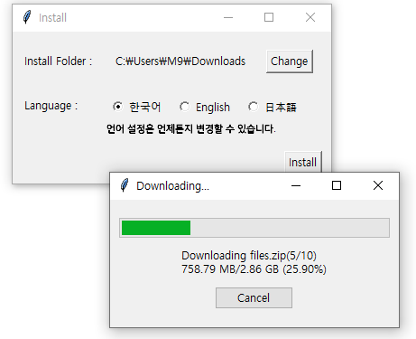

# 👩‍💻 MY Little JARVIS - 나만의 작은 AI 비서


## Installer Download : release or <https://shorturl.at/QrFmp>

- Installer 명세
  - 개요 : python 설치, version, venv, gmake, gpu 설정 등 복잡한 설정 없이 원클릭 Install 파일 지원
  
  - 설치방법
    1. 위에서 Download하신 Installer.exe를 실행해주세요.
       - 실행한 프로그램 우측 하단의 Install을 클릭하시면 Installer.exe 위치에 바로 설치됩니다. (설치할 위치나 언어를 변경할 수 있습니다.)
    2. 설치가 완료되었다는 안내메시지가 뜨면 확인을 눌러 종료해주세요.
    3. Done! 설치된 폴더에 있는 Jarvis.exe를 실행해주세요.
- 프로그램 명세
  - 구동환경 : Windows
  - 용량 : 13.2GB
  - 지원언어 : 한국어/English/日本語

## 개요

- 나만을 위한 그냥 좀 많이 똑똑한 시스템(Just A Rather Very Intelligent System)
- 오픈소스 AI(로컬 LLM)으로 만든 나만의 작은 AI 비서

## 배경

현재 클라우드 기반 AI 서비스는 개발자에게 불편하고 비용이 많이 든다는 문제로 인해, AI 수익화가 어려워지고 있으며, 기업 중심의 서비스로 전환이 가속화되고 있습니다.

[My little Jarvis] 프로젝트는 로컬 LLM을 활용해 개발자가 비용 없이 직접 AI 시스템을 구축하고 제어할 수 있도록 함으로써 이러한 제약을 극복하고자 합니다.

이를 통해 개인 사용자들도 비싼 클라우드 서비스에 의존하지 않고, 실생활에서 유용하게 사용할 수 있는 상업적 가치가 있는 AI 비서를 활용할 수 있게 될 것입니다.

## 주요기능

- 상호작용 가능한 인터페이스: 친숙한 윈도우 환경에서 AI 합성기술로 만든 애니메이션 포함 이미지를 가진 비서와 실제로 대화하는 듯한 인터페이스를 제공합니다.
- 오픈소스 AI를 통한 대답 추론 및 생성: LLAMA3.1의 양자화 AI 모델을 기반으로 개인 PC 환경에서 자연스럽고 빠른 대화를 생성합니다.
- 글로벌한 언어 제공 및 세부 설정 기능: 질문과 답변에 한/영/일 언어를 선택할 수 있으며, 캐릭터 상호작용 빈도 및 크기 등을 설정할 수 있습니다.
- 메타 인지를 통한 캐릭터 해석 및 AI 쪽에서 대화: AI가 캐릭터를 해석하고, 유저가 아닌 AI가 먼저 말을 거는 기능을 제공하여 대화 진입장벽을 낮춥니다.
- 의도 파악 기능: 유저의 입력을 분석해 특정 포맷으로 반환하여, 대화의 맥락을 파악하고 다른 기능과 연계할 수 있습니다.
- 메모리 기능: 대화 내용 자체를 기억하고 다음 대화에 반영하고, 대화에서 유저와 AI의 성격을 파악합니다.
- 화상 인식 기능: 화면 일부 또는 입력된 이미지를 AI 비서의 입력값으로 활용할 수 있습니다.
- Web 검색 기능: 웹 검색 결과를 반영해 최신 정보나 필요한 정보를 대화에 활용할 수 있습니다.
- 음성 인식 기능: 음성인식을 통해 대화가 가능하며, VAD 기능으로 음성과 소음을 구분합니다.
- Easy Installer: 클릭 한 번으로 설치가 가능한 Installer를 제공하며, 설치 위치와 언어를 설정할 수 있습니다.
- 최적화된 리소스 사용 : 상황에 맞춰 CPU/GPU 사용여부를 선택할 수 있고, GPU 사용시 최적화된 VRAM 사용량을 추천해줍니다.
- 서버 기능 : Flask를 통해 API로 출력할 수 있게 하여 서버로서 활용하여 멀티플랫폼을 구축할 수 있습니다.

## 이런 당신에게 필요한 프로젝트

- 캐릭터와 상호작용하고 싶으신 분
  - 높은 확장성으로 장르를 가리지 않고 대응할 수 있습니다.
  - 타 프로그램 이용중에도 대화가 가능합니다.
- 정서적 교감이 필요하신 분
  - 넓어가는 간병인시장
  - 격려와 피드백을 통한 의욕고취
- 높은 AI 접근 장벽이 무서운 개발자/사용자
  - 개발자는 작게는 파이썬 버전부터 크게는 dll설치까지 극악인 환경설정이 필요하지만, wheel로 가장 어려운 부분의 설치를 조율하여 개발에만 집중할 수 있습니다.
  - 사용자도 복잡한 repo clone이나 설치 없이 원 클릭으로 가능한 설치환경 제공합니다.

## 차별점 : Why JARVIS?

Closed AI가 높은 편의성

| **차이점**           | **Closed AI(GPT, Claude...)**                  | **Open Source(My Little Jarvis)**          |
|----------------------|-----------------------------------------------|-----------------------------------------------|
| **생태계**           | 대기업 위주                                    | 오픈소스.                                     |
| **기술 공유**         | 대기업 중심의 관리                               | 개발자 및 사용자 중심의 대규모 글로벌 커뮤니티   |
| **비용**             | 클라우드 기반, 종량제 요금제 사용.비쌈.            | 로컬 기반(+클라우드 지원), 무료.            |
| **보안**             | 데이터가 서버로 전송될 수 있음                | 데이터가 외부로 전송되지 않음                 |
| **컨트롤 자유도**    | 설정된 파라미터 내에서 이용                      | 개발자가 파라미터 설정 가능                   |
| **인터넷 연결**      | 인터넷 필수, 서버에 의존                          | 인터넷 없이 오프라인으로 작동 가능               |
| **확장성**           | API로 확장 가능, 제한된 커스터마이징               | 오픈소스라 다양한 기능 확장 및 모듈 추가 가능    |
| **모델**             | 고정된 클라우드 모델 사용, 주어진 선택지에서 선택   | 다양한 모델을 직접 소유하고 경량화하거나 개조할 수 있음   |
| **하드웨어**         | 높은 수준의 하드웨어 필요. (개인PC 불가)       | 수준에 맞는 하드웨어로 구동 가능. (개인PC 가능)   |

## 주요 서비스 화면

### 인터페이스

- 사용 Tool : Stable-Diffusion, ComfyUI
- 사용 기술 : Text-to-Image, ControlNet, (+인페인팅), toonCrafter
- 화면에서 [직관적으로 상호작용]하는 인터페이스를 로컬에서 완성


### 의도파악

- [질문에 Web 검색이 필요할까?] 를 AI가 생각하게 함


### Web검색

- 입력된 이미지나 설정된 배경에 관한 대화 기능


### 화상인식

- 입력된 이미지나 설정된 배경에 관한 대화 기능


## 프로젝트 환경

- Python 3.9.6
  - 가장 복잡한 설정이 필요한 llama-cpp-python을 wheel로 설치하기 때문에 requirements.txt는 추천되지 않습니다.
- Cuda 11.6

``` bash
py -3.9 -m venv venv

# 일반 library
pip install pyinstaller
pip install googletrans==4.0.0-rc1
pip install tkinterdnd2 # tkinter 보조로 drag and drop 등의 외부 입력 받음
pip install pyaudio
pip install keyboard
pip install pygame
pip install Unidecode
pip install Flask
pip install screeninfo

# websearch 관련
pip install sentence-transformers
pip install beautifulsoup4
pip install optimum
pip install duckduckgo_search==6.1.0
pip install lxml
pip install faiss-cpu==1.8.0
pip install rank_bm25==0.2.2

# AI 관련 library
## 기본
pip install langchain
pip install langchain-community
pip install torch==1.13.1+cu116 torchvision==0.14.1+cu116 torchaudio==0.13.1 --extra-index-url https://download.pytorch.org/whl/cu116
pip install llama-cpp-python --extra-index-url https://abetlen.github.io/llama-cpp-python/whl/cu121 --upgrade --force-reinstall --no-cache-dir
pip install pynvml  # GPU 
pip install transformers==4.41.0
## 음성인식
pip install sounddevice
pip install faster-whisper
pip install SpeechRecognition  # init에 faster-whisper을 위한 함수 개조 있음
## 음성합성(VITS)
pip install jamo g2pk2 
pip install ko-pron
pip install Cython
pip install scipy==1.12.0
pip install librosa
# pip install pyopenjtalk==0.2.0 # 일본어음성합성시 필요
## 화상인식
pip install einops timm  # florence

## 버전정합성(conflict)
pip install numpy==1.22.4
pip install httpx==0.13.3

### Legacy (Not using)
pip install llama-cpp-python --prefer-binary --extra-index-url=https://jllllll.github.io/llama-cpp-python-cuBLAS-wheels/AVX2/cu116

```

- 사용 AI 기술
  - AI 대답 생성 및 의도 파악, 번역, 서버 등 주요 AI 모듈
    - 사용 주 기술 : LLama.cpp, langchain, transformers
    - 사용 모델 : Meta-Llama-3.1-8B-Instruct-Q4_K_M.gguf
  - AI 캐릭터 생성
    - 사용 도구 : Stable Diffusion
    - 사용 주 모델 : Animagine3.1
  - AI 캐릭터 애니메이션 생성
    - 사용 도구 : Stable Diffusion, ComfyUI
    - 사용 주 기술 : AnimateDiff, ToonCrafter
  - Web 검색용 단어 단축
    - 사용 주 기술 : sentence-transformers, duckduckgo_search
    - 사용 모델 : all-MiniLM-L6-v2
  - AI 음성 합성
    - 사용 기술 : VITS (ISTFT로 고속 추론)
    - 사용 데이터 : KSS 오픈 데이터
  - AI 음성 인식
    - 사용 기술 : faster-whisper + sound, VAD
    - 사용 모델 : Systran-faster-whisper-small, sillero_vad
  - AI 화상 인식
    - 사용 기술 : Florence2
    - 사용 모델 : Microsoft-Florence-2-base
- 외부 파일
  - kss_korean_ISTFT.pth
  - Meta-Llama-3.1-8B-Instruct-Q4_K_M.gguf
  - Microsoft-Florence
  - Sentence Transformers-all-MiniLM-L6-v2
  - Faster-whisper(small)
  - sillero_vad.onnx

## 배포

- 패키징

``` bash
pyinstaller --onedir main.py -n jarvis --noconsole --contents-directory=files --noconfirm --icon=./assets/ico/icon_arona.ico
pyinstaller --onedir server_interface.py -n jarvis_server --noconsole --contents-directory=files_server --noconfirm --icon=./assets/ico/icon_arona.ico
pyinstaller --onedir server_interface_jp.py -n jarvis_server_jp --contents-directory=files_server --noconfirm --icon=./assets/ico/icon_arona.ico --noconsole 
```

- 정식 다운로드 링크 : [https://huggingface.co/mingu4969/my-little-jarvis-dist/resolve/main/Install.exe]

## Special Thanks

- 이번 프로젝트에서 사용한 [Nexon]의 [블루아카이브] IP에 관하여, 여러번에 걸친 연락과 문의 끝에 [문제가 있으면 조치한다]는 형태로 IP 사용을 수락 받았습니다. ([증적](docs/special_thanks_nexon.md))
- 이 프로젝트는 원본 리소스, 음성, Asset등의 자산을 활용하지 않았고, [Nexon게임IP사용가이드](https://member.nexon.com/policy/gameipguide.aspx)를 준수하였습니다.
- 이 자리를 빌어 감사의 말씀을 전합니다.
