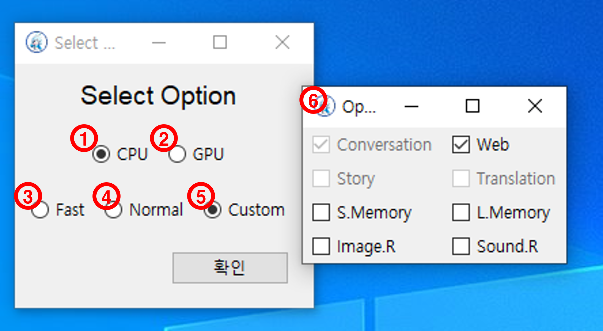
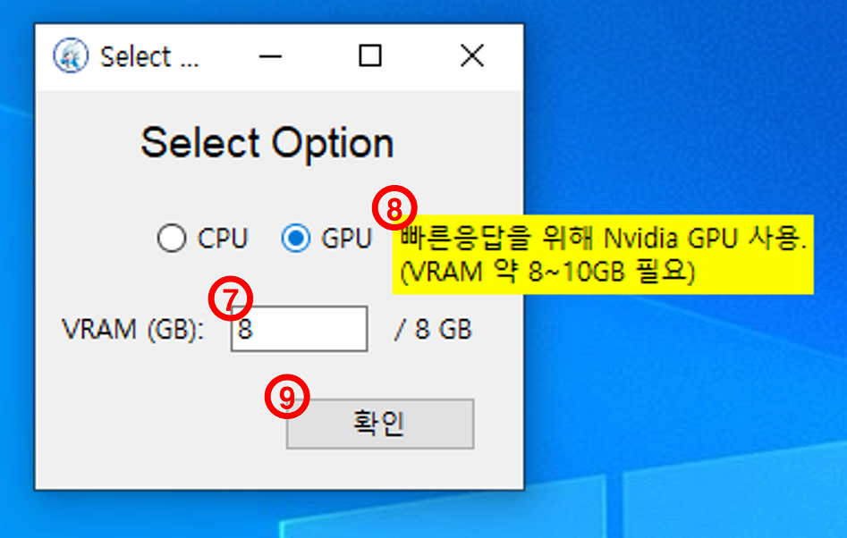

# 사용 가이드

## 최초 구동

- 개요 : 최초 구동시 옵션 설정

1. CPU : GPU 가속없이 사용
2. GPU : 빠른응답을 위해 Nvidia GPU를 사용. (VRAM 최대 8GB까지 분배 가능)
3. CPU 옵션 - Fast : 최소한의 모듈만 캐싱
4. CPU 옵션 - Normal : 사용가능한 모든 모듈을 캐싱
5. CPU 옵션 - Custom : 원하는 모듈을 선택하여 사용
6. Custom 상세 화면 : (5)를 선택시 팝업. 원하는 모듈을 선택
7. 사용 VRAM : 최대 8GB까지 입력 가능. (현재 사용가능한 VRAM - 2GB가 선입력되어 있음)
8. 호버 팁 : 특정 UI위에 마우스를 올려두면(hover) 나오는 Tip메시지풍선
9. 확인 : 현재 옵션 설정대로 프로그램을 시작
