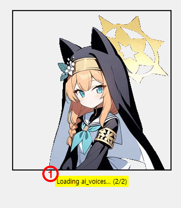
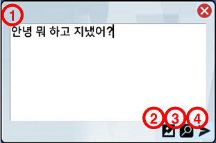
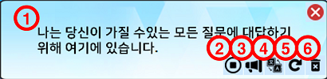
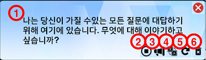
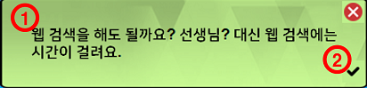
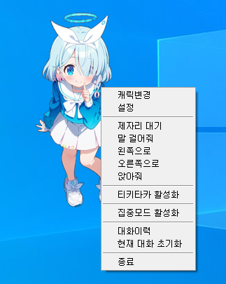
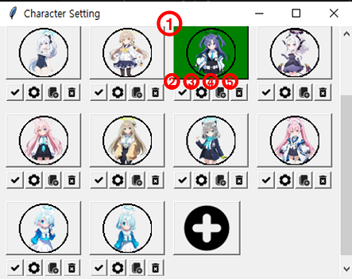
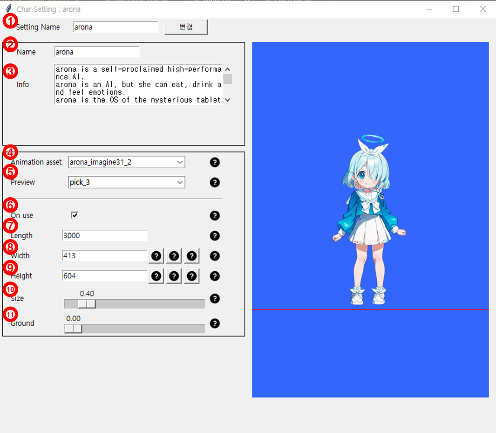
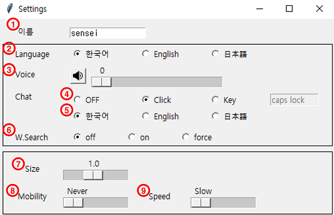

# 사용 가이드

## 최초 구동

- 개요 : 최초 구동시 옵션 설정

1. CPU : GPU 가속없이 사용
2. GPU : 빠른응답을 위해 Nvidia GPU를 사용. (VRAM 최대 8GB까지 분배 가능)
3. CPU 옵션 - Fast : 최소한의 모듈만 캐싱
4. CPU 옵션 - Normal : 사용가능한 모든 모듈을 캐싱
5. CPU 옵션 - Custom : 원하는 모듈을 선택하여 사용
6. Custom 상세 화면 : (5)를 선택시 팝업. 원하는 모듈을 선택
7. 사용 VRAM : 최대 8GB까지 입력 가능. (현재 사용가능한 VRAM - 2GB가 선입력되어 있음)
8. 호버 팁 : 특정 UI위에 마우스를 올려두면(hover) 나오는 Tip메시지풍선
9. 확인 : 현재 옵션 설정대로 프로그램을 시작

## 로딩 화면

- 개요 : 옵션 설정 후 확인 버튼을 누르면 모듈 로딩이 시작되고 진행상황을 로딩 화면으로 표시합니다.

1. 현재 로딩중인 모듈 및 전체 모듈 중 진행상태

## 기본 조작

- 개요 : 캐릭터 상호작용에 관한 기본 조작입니다.

좌클릭 : 채팅 시작(채팅 말풍선 보이기)  
좌클릭 드래그 & 드롭 : 캐릭터를 원하는 위치로 이동  
우클릭 : 메뉴  

## UI 설명

- 채팅 말풍선

    

1. 입력공간 (입력 공간 내에서 엔터 입력시 [4.질문]가 동작합니다.)
2. 대화에 사용할 이미지 추가
3. 웹 검색을 강제한 질문
4. 질문
5. 닫기

- 답변 말풍선 (답변 생성중)

    

1. 답변 중 답변(밝은 하늘색 배경)
2. 중지
3. 음성 다시 재생
4. 표시 언어 변경(한->영->일->한)
5. 재생성
6. 답변 삭제(해당 답변과 질문이 메모리에 저장되지 않음)

- 답변 말풍선 (답변 완료)

    

1. 답변 완료 답변(파란색 배경)
2. 중지
3. 음성 다시 재생
4. 표시 언어 변경(한->영->일->한)
5. 재생성
6. 답변 삭제(해당 답변과 질문이 메모리에 저장되지 않음)

- 질문 말풍선

    

1. 캐릭터로부터의 질문(녹색 배경)
2. 확인 : 제안을 받아들여 작업합니다.

## 메뉴 설명

- 캐릭 변경

    

1. 캐릭터 변경(초록배경 = 현재 캐릭터)
2. 메인 캐릭터 변경(프로그램 기동시 등장 캐릭터)
   - 메인 캐릭터가 없을 경우, 마지막 캐릭터가 등장
3. 캐릭터 상세
4. 캐릭터 복제
5. 캐릭터 삭제

- 캐릭터 상세

    

1. 설정에서의 캐릭터 식별명
2. AI가 인식하는 캐릭터 이름
3. AI 캐릭터 프롬프트
4. /animation 폴더의 assets 선택
5. animation asset 중 animation을 preview
6. 애니메이션 사용 여부
7. 애니메이션 재생 길이
8. 애니메이션 가로 길이
9. 애니메이션 세로 길이
10. 애니메이션 비율 축척
11. 애니메이션 지상 설정

- 설정

    

1. 플레이어 이름
2. 설정/UI에서 사용하는 언어
   - 몇몇 UI 언어는 최초 기동시 결정되어 재기동이 필요
3. 음소거 설정 및 음량
4. 채팅설정
   1. OFF : 좌클릭해도 채팅이 시작되지 않음
   2. Click : 좌클릭시 채팅 시작
   3. Key : 이후 설정하는 Key 입력 또는 좌클릭으로 채팅 시작
5. 채팅설정 - 답변 언어
   - 질문 언어는 언어 무관
6. 웹검색설정
   1. OFF : 질문답변에 웹검색을 사용하지 않음
   2. ON : 웹검색이 필요해보이면 유저에게 물어봄
      - 질문 말풍선이 발생
   3. Force : 모든 질답에 웹검색 내용이 포함됨
7. 캐릭터 크기
8. 캐릭터 이동빈도
9. 캐릭터 이동속도
